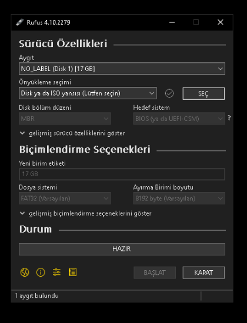
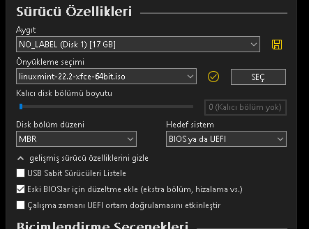
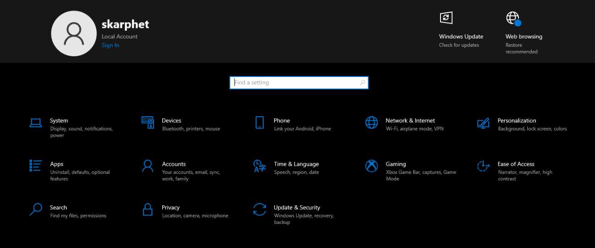
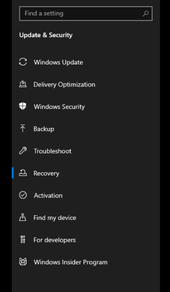
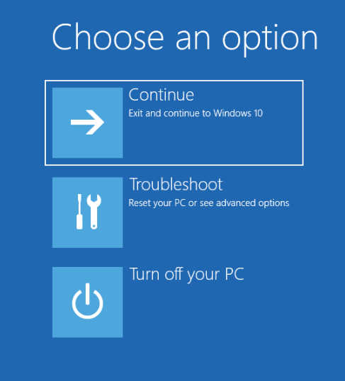

# Windows'tan Linux'a Geçiş ve Linux'u Ön İzleme

Bu rehberde, Windows yüklü bir sisteme nasıl Linux kurulabileceğinden ve ön izlenebileceğinden bahsedeceğiz.

!!! note "Kurulum yapmadan deneme"

    Çoğu dağıtım, kurulumdan önce dağıtımın test edilebileceği bir [**canlı sistem**](https://tr.wikipedia.org/wiki/Canl%C4%B1_sistem) sunmaktadır. Canlı sistem, dağıtımı kurmadan da deneyimleyebileceğiniz bir ortam sağlamaktadır. Canlı sisteme erişmek için de bu rehberdeki aşamaları takip edebilirsiniz.

## Gereksinimler

- USB bellek (min. 5-6 GB alan, dağıtımdan dağıtıma boş alan gereksinimi değişebilir)
- İnternet bağlantısı

## Flaş diski hazırlama

Öncelikle [tercih ettiğiniz dağıtımın](https://linuxturkey.kavakci.dev/rehberler/hangi_dagitim.html) ISO dosyasını, dağıtımın websitseinden indirmeniz gerekiyor.

### Dağıtım ISO'sunu indirme (örneğin Linux Mint)

1. [Linux Mint](https://linuxmint.com/) web sitesinden _Download_ bölümüne gelin.
2. Tercih ettiğiniz masaüstü ortamına göre ilgili _Download_ butonuna tıklayın. Biz bu rehber için Xfce versiyonunu indireceğiz.
3. Butona tıkladığınzda ve aşağı kaydırdığınızda karşınıza dünyanın farklı yerlerinden indirebilmenize imkan sağlayan bir tablo çıkacak
4. Buradan size en yakın olan bölgeye göre ISO indirme işleminizi başlatın. Veya direkt olarak _World_ seçeneğini tercih edebilirsiniz.

İndirme işlemi tamamlandıktan sonra bir sonraki aşamaya geçiş yapabilirsiniz.

### ISO'yu Rufus ile USB belleğe yazdırma

!!! danger "Uyarı"

    Bu işlem sonucunda USB belleğinizdeki tüm veriler silinecektir. Eğer elinizdeki USB belleğinde önemli veriler barındırıyorsa yedeklemeyi unutmayın.

ISO dosyamızı flaş diskine yazdırmak için bu rehberde _Rufus_ aracını kullanacağız.

<ol>
  <li>
    <a href="https://rufus.ie/tr">Rufus</a> web sitesinden Rufus USB yazdırma aracını indirin.
  </li>
  <li>
    Rufus'u açtığınızda karşınıza aşağıdaki gibi bir arayüz çıkacaktır. 
    
  </li>
  <li>
    Buradaki <em>Aygıt</em> kısmı, ISO'yu yazdırmak istediğiniz USB belleği belirtir.
  </li>
  <li>
    Hemen altında kalan <em>Önyükleme seçimi</em> ise, seçeceğiniz ISO dosyasını belirtir.
  </li>
  <li>
    <em>SEÇ</em> butonuna tıklayın ve indirdiğiniz ISO dosyasını bulup seçin.
  </li>
  <li>
    Eğer bilgisayarınız çok eski ise aşağıda gösterilen <em>gelişmiş sürücü özelliklerini göster</em> bölümünü açıp <em>Eski BIOSlar için düzeltme ekle</em> seçeneğini aktif hale getirin: 
     
  </li>
  <li>
    Son olarak <em>BAŞLAT</em> butonuna tıklayıp yazdırma işlemini başlatın.
  </li>
</ol>

## BIOS ekranını açma

<ol>
    <li>
        Windows Ayarlar menüsünü açın 
        
    </li>
    <li>
        <em>Güncelleştirme & kurtarma</em> bölümünü açın
    </li>
    <li>
        <em>Kurtarma</em> menüsüne tıklayın 
        
    </li>
    <li>
        <em>Gelişmiş başlangıç</em> butonuna tıklayın
    </li>
    <li>
        Karşınıza mavi bir ekran ve seçenekler çıkacaktır. <em>sorun giderme</em> butonuna tıklayın.
        
    </li>
    <li>
        Çıkan yeni menüden <em>Gelişmiş seçenekler</em> butonuna tıklayın.
    </li>
    <li>
       Son olarak karşınıza çıkan menüden <em>UEFI Donanım Yazılımı Ayarları</em> butonuna tıklayın.
    </li>
</ol>

Bu aşamaları takip ettiğinizde karşınıza bilgisayarınızın BIOS menüsü çıkacaktır. BIOS menüleri, her bilgisayarda farklı olduğu için BIOS ile alakalı kısımda buradan sonrası için bir rehber yazmak mümkün değildir. Bilgisayarınızın veya ana kartınızın kullanım kılavuzuna veya video platformlarından bilgisayar modelinizle alakalı bir rehbere başvurun.

## Kurulum veya ön izleme

- Eğer kurulum yapmayıp sadece sistemi denemek istiyorsanız. USB belleği önyüklediğinizde karşınıza çıkan sistemi özgürce keşfedebilirsiniz.
- Eğer kurulum yapmak istiyorsanız, dağıtımdan dağıtıma çeşitlilik gösterdiği için video platformlarından veya tercih ettiğiniz dağıtımın kurulumu ile alakalı harici kaynaklardan destek alabilirsiniz. Örneğin: 
  :fontawesome-brands-youtube:{ style="color: #EE0F0F" } [Linux Mint Kurulum Videosu - Murat Süzgün](https://www.youtube.com/watch?v=MQZArEZrx9Y) 
  :fontawesome-brands-youtube:{ style="color: #EE0F0F" } [Fedora Kurulum Videosu - Furkan Yılmaz](https://www.youtube.com/watch?v=4wzRKargwXA) 
  :fontawesome-brands-youtube:{ style="color: #EE0F0F" } [Ubuntu Kurulum Videosu - Yücel Kahraman](https://www.youtube.com/watch?v=b9uFnHwBLn0)
